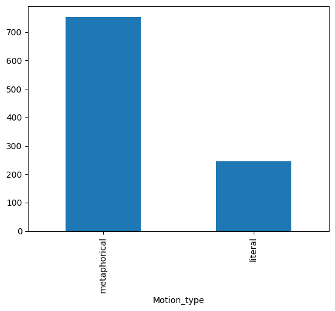
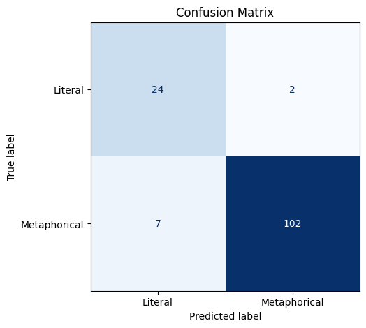
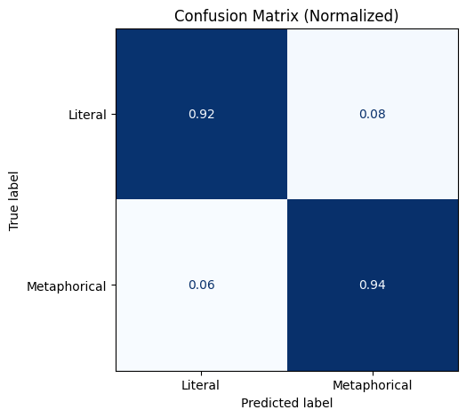
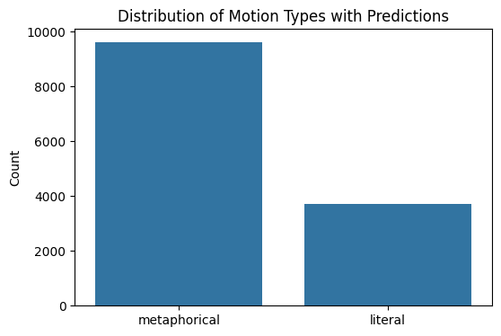

This repository contains code and data for a research project on motion verbs in Ukrainian. 

## Repository contents

Code:
- `parse_data.py` -- used to parse the original web corpus and extract sentences that contain motion verbs
- `extract_dependencies.py` -- used to analyze the found sentences, find verb dependencies (preposition, subject, complement) and filter out unnecessary instances.
- TBA: training and inference of the model.

Data:
- ...

## Task

Our aim was to find and analyze contexts in Ukrainian containing prefixed motion verbs, specifically how the prefixes cooccur with prepositions. There are thus 4 main elements to our analysis:
- Prefix (e.g. _від_-, _при_-)
- Motion verb stem (e.g. _входити_, _виїхати_)
- Preposition (e.g. _до_, _у_)
- Complement (e.g. _складу_, _місце_)

Example from the corpus:
> Перетнувши смугу зустрічного руху на повороті, автомобіль **виїхав** з проїжджої частини **у** **кювет** та зіткнувся з металевим дорожнім знаком.

## Data

To collect the relevant contexts, a web corpus of Ukrainian from 2019 was used. The corpus contains a total of 1 million sentences scraped from the web, and can be downloaded [here](https://wortschatz.uni-leipzig.de/en/download/Ukrainian#ukr-ua_web_2019).

On the first iteration, sentences containing the relevant verbs were extracted. This was done with [Pymorphy2](https://pymorphy2.readthedocs.io/en/stable/) morphological parser, which was used to lemmatize individual tokens and compare to a predefined list of relevant lemmas.

On the second iteration, the Stanza dependency parser was used to extract the prepositions and complements from the verb's dependencies. 

Finally, the prefixes and stems were defined in a separate file (`verb_prefix_map.json`), which was used to annotate each instance.

We provide the full dataset (`full_dataset.csv`), however most of the analysis is done on a different file -- `top1000_dataset.csv`. In order to filter out noise, we have compiled a list of complement frequencies (`object_lemma_counts.csv`), and selected the 1000 most frequent nouns. The dataset was then cut down to only contexts where the compelement appears in this list.

## Metaphorical uses

Motion verbs are often used in metaphorical contexts, which is something we would like to control for. Firstly, we subsample the `data/top1000_dataset.csv` file with seed=42 to include a 1000 random instances. They are then manually classified as literal or metaphorical, which is the gold standard for our classification and can be found in `data/Gold_standard.csv`.

We have found that the data is quite unbalanced, with the majority of contexts being metaphorical.

### 🔢 Class Distribution

| Motion Type   | Count |
|---------------|-------|
| Metaphorical  | 754   |
| Literal       | 246   |
| **Total**     | 1000  |

The Gold standard was split into train, validation, and test subsets with the following ratio:

### 📂 Dataset Split Summary

| Split | X size | y size | % of Total |
|-------|--------|--------|------------|
| Train | 765    | 765    | 76.5%      |
| Val   | 135    | 135    | 13.5%      |
| Test  | 100    | 100    | 10.0%      |
| **Total** | **1000** | **1000** | **100%**     |

A pre-trained encoder for Ukrainian [liberta-large](https://huggingface.co/Goader/liberta-large-v2) was used for training. After grid search for optimal parameters, the following were selected:

### ⚙️ Hyperparameter Configuration

| Parameter                     | Value                        |
|------------------------------|------------------------------|
| Number of Classes            | 2                            |
| Maximum Sequence Length      | 128                          |
| Weight Decay                 | 1e-2                         |
| Model Name                   | Goader/liberta-large         |

### 🏋️ TrainingArguments (Used in Final Run)

| Parameter                     | Value                        |
|------------------------------|------------------------------|
| Train Batch Size             | 8                            |
| Eval Batch Size              | 8                            |
| Learning Rate                | 2e-5                         |
| Number of Epochs             | 3                            |

Additionally, a special token was added to the tokenizer: [TARGET]. This is due to the need to classify the use of the motion verb specifically, not the entire sentence. Without the special token, the model performance was on average 2-3 percentage points lower, since a context may be metaphorical, while the motion verb is used literally, and vice-versa. The special token wrapping was introduced in the dataset class (`TextClassificationDataset`).

### 📈 Model Training Performance

| Epoch | Training Loss | Validation Loss | Accuracy  | F1 Score  | Precision | Recall   |
|-------|---------------|------------------|-----------|-----------|-----------|----------|
| 1     | 0.0529        | 0.7044           | 91.85%    | 0.9507    | 0.9298    | 0.9725   |
| 2     | 0.0239        | 0.6675           | 92.59%    | 0.9550    | 0.9381    | 0.9725   |
| 3     | 0.0221        | 0.6252           | 93.33%    | 0.9577    | 0.9808    | 0.9358   |

Below are two confusion matrices for the predictions on the test set. Since our data is quite unbalanced (majority metaphorical), the matrix with absolute values (on the left) might appear disproportionate. However, the normalized confusion matrix (on the right) demonstrates good performance of the model for both classes/

  
  

The trained model was then used to label the rest of the contexts.

The final annotated dataset (`data/combined_with_predictions.csv`) contains and additional column (Gold_standard) which provides the source of the classification: either manual annotation ('gold') or model's prediction ('model').

For the sake of convenience, we also provide the literal and metaphorical contexts separately: `data/literal.csv` and `data/metaphorical.csv`, with 3706 and 9619 instances respectively. 

The distribution of the final dataset is close to the manually annotated one:

